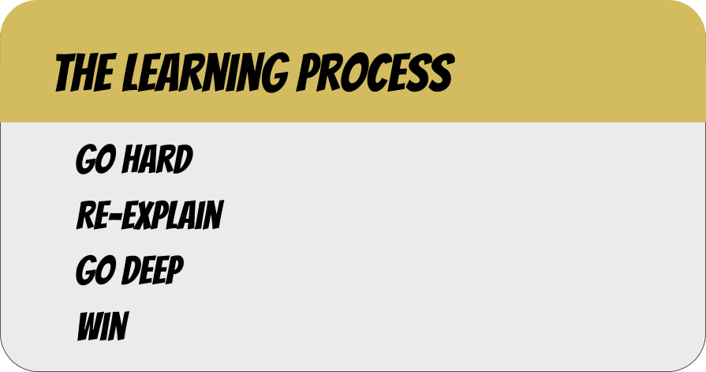

# LeetCode Interview Prep
These are the responses I'm coding for the infamous technical interview. The entire idea behind it, is that by coding all the solutions for myself and placing detailed comments around the idea, with a summarization of how to solve the problem, that I'll be able to understand how to solve these problems.

100% of the problems here will be medium in difficulty. That's for a few reasons:

1. Medium problems require that you amp up your skills while you understand them. That is, both understanding the problem and knowing how to solve it.
2. If I re-explain the problem so someone else can understand it, I'll understand it better.
3. Deeper comments and diagrams will help an outside observer would better understand.

The work here will switch between leetcode explainations and mine:

### Leetcode's Stuff
1. The question - According to leetcode
2. The answer - According to leetcode

### My Explainations
1. Explaining the question to Granny
   * Explaining it using common phrases
   * Replace words like array
2. Explaining the answer to granny
   * We replace words like list, index, traversal, ect. With common sense words such as list, postion, reading
   * Explain where we get out answer from

To read this and get better, I'd recommend you do the following things:

1. Follow an **AN INTERVIEW CODE**. This is how you'd format your interview to get the best possible answer and .
2. Re-summarize the assignment to yourself, then talk out loud about what the issue/puzzle is and what they're asking for. Talk out loud. If it doesn't make sense then, restate it until your fully understand what you're hearing from yourself.
3. Re-type and rework everything to make the code better. Include variable names, and if you recreate comments to make them better understood, create a pull request. 
4. Win. Go out there an get them jobs folks.

### **THE INTERVIEW CODE** - What You Should Get Used To *Asking* and *Saying*
1. **"I'd love to follow this question to completion, though I'll need to get a little bit of information from you regarding the problem."** - This turns the interview into an inclusive process. If you get their agreement, you show you can gather collaboration with the interviewer. This gives a lot of extra points. Also, include **open-minded** if you can. It'll get people to agree with you.
2. **"What I first want to do is understand what the question is asking. My assumption is ... Is that correct?"** - This will show that you're thinking about the question, even though you may not know what it means.
3. **"I'm thinking the input to the question will be ... and the output would be ..."** - This allows you to pinpoint what the I/O of the application would be.
4. **"Would you mind if I talk during exploration of finding a solution?"** - This gets permission to talk through the interview. It's very useful when you don't know the answer and you want to explain that while you don't have it, that you'll be searching through a solutions space.
5. Start by explaining a solution once you think you've found it.
   1. **"I'm thinking the solution to the problem will be ... . Is that solution okay?"** - This forces the interviewer to think about the problem themselves.
6. Start off with some pseudo-code. 
   1. **"I'm going to start with some planning"** - Shows how much you value plans.
7. Dive deep into actual code.
8. Pray that it was the solution.